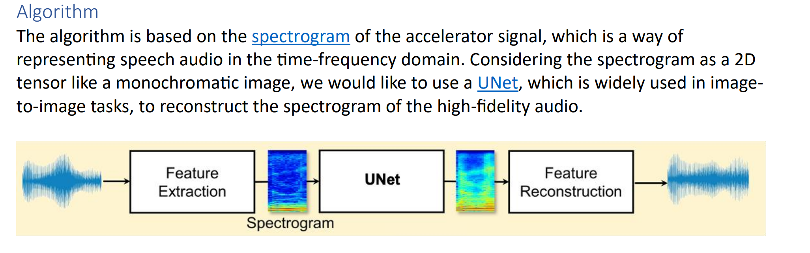
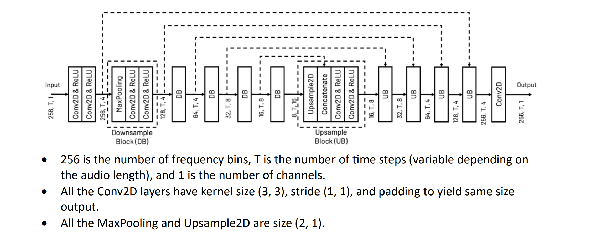
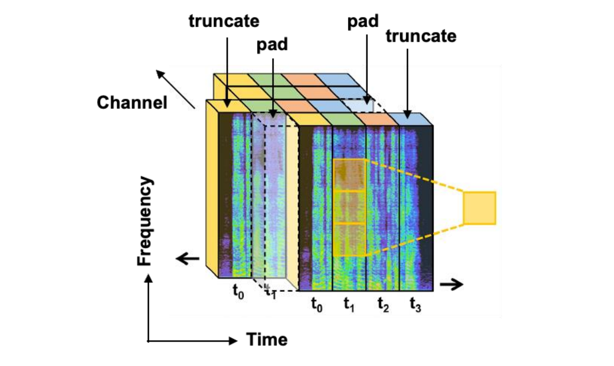

# TSConv
Implements a time-shifted convolution operation. Primarily used for spectrogram data to improve the quality of input.
There are two implementations available:
* Baseline UNet with Convolution Layers (Conv).
* Time-Shifted Convolution (TSConv) layer for temporal convolution.

## Getting Started

### Requirements

* Python 3.6 or higher
* PyTorch 1.7 or higher
* NumPy
* Matplotlib

1. Install the required packages:

   ````
   pip install -r requirements.txt
   ```

### Working
* Algorithm


1. U-Net model


2. `TSConv` model
 


## Contributing

Contributions are welcome! Please feel free to submit a pull request.

## License

This project is licensed under the MIT License - see the [LICENSE](LICENSE) file for details.

## Acknowledgments

* This project was inspired by the U-Net architecture proposed in [Ronneberger et al., 2015](https://arxiv.org/abs/1505.04597) and the Time-Shifted Convolution proposed in [Tsai et al., 2021](https://arxiv.org/abs/2102.04799).
* The implementation of the U-Net model is adapted from [milesial/Pytorch-UNet](https://github.com/milesial/Pytorch-UNet).
* The implementation of the TSConv layer is adapted from [open-mmlab/mmcv](https://github.com/open-mmlab/mmcv).
